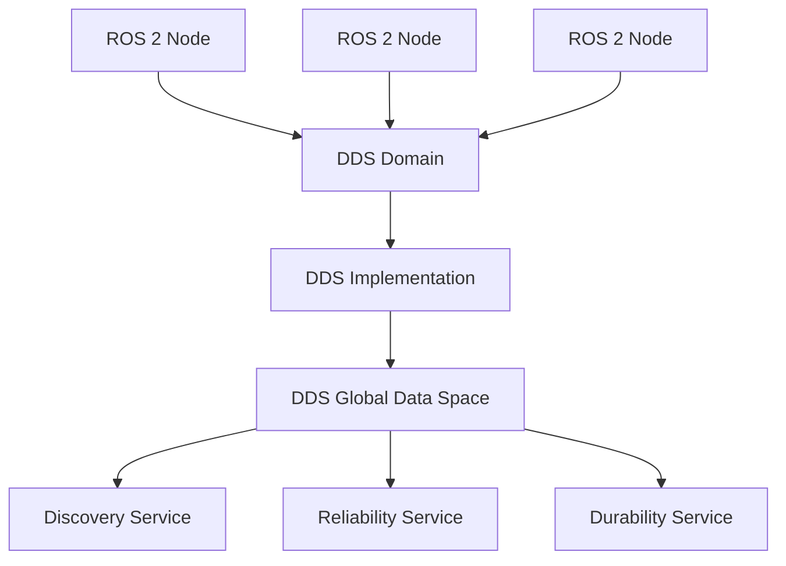

# Chapter 1.1 – ROS 2 Architecture & DDS

## Learning Objectives
- Understand the fundamental differences between ROS 1 and ROS 2
- Explain the role of DDS in ROS 2 communication
- Describe real-time and distributed systems concepts in robotics
- Identify humanoid-specific constraints in ROS 2 architecture

## ROS 2 vs ROS 1

ROS 2 represents a major architectural shift from ROS 1, addressing several critical limitations:

- **Middleware Independence**: ROS 2 uses Data Distribution Service (DDS) as its underlying communication middleware
- **Real-time Support**: Native support for real-time systems with deterministic behavior
- **Multi-robot Systems**: Improved support for distributed robotics applications
- **Security**: Built-in security features for authenticated and encrypted communication

```
ROS 1 Architecture: Master-Slave
  - Centralized ROS Master
  - XML-RPC communication
  - Single point of failure

ROS 2 Architecture: Distributed
  - DDS-based communication
  - Peer-to-peer discovery
  - No central coordinator
```

## DDS Fundamentals

Data Distribution Service (DDS) is a middleware standard for real-time, distributed systems. In ROS 2, DDS provides:

- **Data-Centricity**: Focus on data rather than communication endpoints
- **Quality of Service (QoS)**: Configurable policies for reliability, durability, and latency
- **Discovery**: Automatic discovery of participants in the network
- **Type Safety**: Strong typing with IDL (Interface Definition Language)



## Real-time and Distributed Systems

For humanoid robots, real-time constraints are critical for:

- **Balance Control**: Maintaining stability with millisecond-level response times
- **Sensor Fusion**: Processing multiple sensor streams with low latency
- **Trajectory Execution**: Precise timing for joint control

DDS QoS profiles enable real-time behavior through:

```python
from rclpy.qos import QoSProfile, QoSReliabilityPolicy, QoSHistoryPolicy

# Real-time profile for sensor data
sensor_qos = QoSProfile(
    reliability=QoSReliabilityPolicy.RELIABLE,
    history=QoSHistoryPolicy.KEEP_LAST,
    depth=10
)

# Best-effort profile for visualization
viz_qos = QoSProfile(
    reliability=QoSReliabilityPolicy.BEST_EFFORT,
    history=QoSHistoryPolicy.KEEP_LAST,
    depth=1
)
```

## Humanoid Robotics Constraints

Humanoid robots present unique challenges in ROS 2 architecture:

- **Computational Limits**: Limited processing power on-board
- **Power Constraints**: Battery life considerations
- **Latency Requirements**: Critical for balance and safety
- **Network Topology**: Multiple computers distributed across the robot

## Practical Exercise

1. Create a simple ROS 2 publisher and subscriber with different QoS profiles
2. Observe the discovery process using `ros2 topic list`
3. Experiment with reliability and durability settings

## Summary

ROS 2's DDS-based architecture provides the foundation for robust, distributed humanoid robot systems. The middleware independence allows for various DDS implementations optimized for different use cases, while QoS profiles enable fine-tuning for specific requirements of humanoid robotics applications.