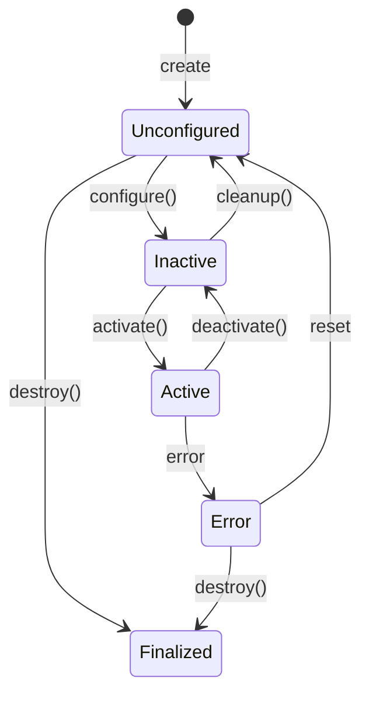

# Chapter 1.2 – Nodes, Topics, Services, and Actions

## Learning Objectives
- Understand the lifecycle of ROS 2 nodes
- Implement topic-based streaming for humanoid control
- Distinguish between services and actions for different use cases
- Design control loops optimized for humanoid robotics

## Node Lifecycle

ROS 2 nodes follow a well-defined lifecycle that enables more robust system management:



For humanoid robots, the lifecycle pattern is particularly useful for:
- **Safe startup**: Gradual activation of joint controllers
- **Error recovery**: Isolated recovery of specific subsystems
- **Power management**: Deactivating unused components

```python
import rclpy
from rclpy.lifecycle import LifecycleNode, LifecycleState, TransitionCallbackReturn
from rclpy.lifecycle import Publisher
from std_msgs.msg import String

class HumanoidControlNode(LifecycleNode):
    def __init__(self):
        super().__init__('humanoid_control_node')
        self.pub: Publisher = None

    def on_configure(self, state: LifecycleState) -> TransitionCallbackReturn:
        self.pub = self.create_lifecycle_publisher(String, 'robot_status', 10)
        self.get_logger().info('Configured')
        return TransitionCallbackReturn.SUCCESS

    def on_activate(self, state: LifecycleState) -> TransitionCallbackReturn:
        self.pub.activate()
        self.get_logger().info('Activated')
        return TransitionCallbackReturn.SUCCESS

    def on_deactivate(self, state: LifecycleState) -> TransitionCallbackReturn:
        self.pub.deactivate()
        self.get_logger().info('Deactivated')
        return TransitionCallbackReturn.SUCCESS

    def on_cleanup(self, state: LifecycleState) -> TransitionCallbackReturn:
        self.destroy_publisher(self.pub)
        self.pub = None
        self.get_logger().info('Cleaned up')
        return TransitionCallbackReturn.SUCCESS
```

## Topic-Based Streaming

Topics enable asynchronous, publisher-subscriber communication ideal for:
- **Sensor streams**: IMU, joint encoders, camera feeds
- **Control commands**: Joint positions, velocities, torques
- **Status updates**: Battery level, joint temperatures

For humanoid robots, consider these QoS settings:

```python
from rclpy.qos import QoSProfile, DurabilityPolicy, ReliabilityPolicy

# High-frequency sensor data
sensor_qos = QoSProfile(
    depth=1,  # Only keep latest message
    reliability=ReliabilityPolicy.BEST_EFFORT,
    durability=DurabilityPolicy.VOLATILE
)

# Critical control commands
control_qos = QoSProfile(
    depth=5,  # Keep some history
    reliability=ReliabilityPolicy.RELIABLE,
    durability=DurabilityPolicy.TRANSIENT_LOCAL
)
```

## Services vs Actions

### Services
- **Request/Response pattern**
- **Synchronous** (caller waits for response)
- **Suitable for**: Simple queries, configuration changes
- **Example**: Get joint position, set mode

### Actions
- **Goal/Result/Feedback pattern**
- **Asynchronous** with progress updates
- **Suitable for**: Long-running tasks, trajectories
- **Example**: Execute walking gait, move to position

```python
# Service call example
from example_interfaces.srv import SetBool

client = node.create_client(SetBool, 'enable_controller')
request = SetBool.Request(data=True)

future = client.call_async(request)
# Node continues execution while waiting

# Action example
from example_interfaces.action import Fibonacci
from rclpy.action import ActionClient

class TrajectoryClient:
    def __init__(self, node):
        self._action_client = ActionClient(node, Fibonacci, 'execute_trajectory')

    def send_goal(self, order):
        goal_msg = Fibonacci.Goal(order=order)
        self._action_client.wait_for_server()
        return self._action_client.send_goal_async(goal_msg, feedback_callback=self.feedback_callback)

    def feedback_callback(self, feedback_msg):
        self.get_logger().info(f'Received feedback: {feedback_msg.feedback.sequence}')
```

## Control Loops for Humanoids

Humanoid robots require multiple control loops running at different frequencies:

- **High-frequency (1-10kHz)**: Joint position/velocity control
- **Mid-frequency (100-500Hz)**: Balance control, inverse kinematics
- **Low-frequency (10-50Hz)**: Walking pattern generation, path planning

```python
class BalanceController(LifecycleNode):
    def __init__(self):
        super().__init__('balance_controller')
        self.control_timer = self.create_timer(
            0.002,  # 500Hz for balance control
            self.balance_control_callback
        )
        self.imu_sub = self.create_subscription(
            Imu, 'imu/data', self.imu_callback, 1
        )
        self.joint_pub = self.create_publisher(
            JointState, 'joint_commands', 1
        )

    def balance_control_callback(self):
        # Implement balance control algorithm
        # Calculate necessary joint adjustments
        # Publish commands
        pass
```

## Practical Exercise

1. Create a lifecycle node that controls a simulated humanoid joint
2. Implement both service and action interfaces for joint control
3. Compare performance of different QoS profiles for sensor data

## Summary

The ROS 2 communication patterns provide the foundation for robust humanoid robot control. Nodes manage lifecycle states for safe operation, topics enable high-frequency streaming, services handle synchronous requests, and actions manage long-running tasks with feedback. Understanding these patterns is crucial for designing efficient humanoid robot architectures.