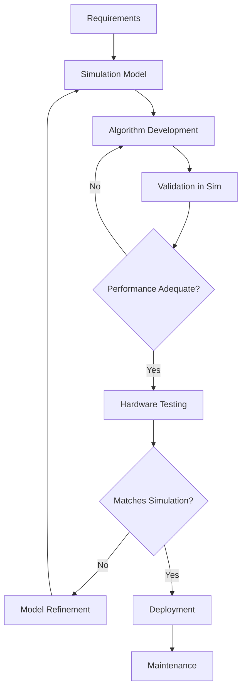

# Chapter 2.4 – Digital Twin Validation

## Learning Objectives
- Understand sim-to-real gaps in humanoid robotics
- Implement performance profiling methods for digital twins
- Ensure determinism and repeatability in simulation
- Establish simulation-driven development workflows

## Sim vs Real Gaps

Digital twins face several challenges when bridging simulation and reality. Understanding these gaps is crucial for humanoid robot development:

### Physical Property Discrepancies

Real robots have properties that are difficult to model perfectly:

- **Friction**: Real-world friction varies with surface conditions, temperature, and wear
- **Flexibility**: Real joints have compliance not captured in simulation
- **Actuator Dynamics**: Real motors have different response characteristics
- **Sensor Noise**: Real sensors have different noise patterns

```python
# Example: Compensating for sim-to-real gaps
class Sim2RealCompensation:
    def __init__(self):
        self.friction_compensation = 0.1  # Additional friction in sim
        self.actuator_delay = 0.02  # 20ms delay
        self.sensor_noise_multiplier = 1.5  # 1.5x more noise in sim

    def apply_friction_compensation(self, joint_effort, joint_velocity):
        # Add additional friction to simulate real-world behavior
        compensated_effort = joint_effort - (joint_velocity * self.friction_compensation)
        return max(-100, min(100, compensated_effort))  # Limit to realistic values

    def add_sensor_delay(self, sensor_data, delay_buffer):
        # Simulate sensor processing delay
        delay_buffer.append(sensor_data)
        if len(delay_buffer) > int(self.actuator_delay / 0.001):  # Assuming 1ms sim step
            return delay_buffer.pop(0)
        return sensor_data
```

### Environmental Differences

- **Surface Properties**: Real surfaces have varying friction, compliance, and texture
- **Lighting Conditions**: Affects camera-based perception differently
- **Air Resistance**: Negligible in simulation but present in reality
- **Electromagnetic Interference**: Can affect sensors in real environments

### Control Algorithm Adaptation

```cpp
// Example: Adaptive control to handle sim-to-real gaps
class AdaptiveController {
private:
    double adaptation_rate = 0.01;
    double model_error = 0.0;
    double parameter_adjustment = 0.0;

public:
    double computeControl(const State& desired, const State& actual) {
        // Standard control computation
        double control_output = standardController(desired, actual);

        // Adapt based on model error
        model_error = desired.position - actual.position;
        parameter_adjustment += adaptation_rate * model_error * actual.velocity;

        // Apply parameter adjustment
        control_output += parameter_adjustment;

        return control_output;
    }
};
```

## Performance Profiling

Comprehensive profiling ensures digital twins accurately represent real robot performance:

### Computational Performance

```python
import time
import psutil
import matplotlib.pyplot as plt

class PerformanceProfiler:
    def __init__(self):
        self.timestamps = []
        self.cpu_usage = []
        self.memory_usage = []
        self.simulation_times = []

    def start_profiling(self):
        self.start_time = time.time()
        self.process = psutil.Process()

    def profile_step(self):
        # Record timestamp
        current_time = time.time()
        self.timestamps.append(current_time - self.start_time)

        # Record system metrics
        self.cpu_usage.append(self.process.cpu_percent())
        self.memory_usage.append(self.process.memory_info().rss / 1024 / 1024)  # MB

        # Record simulation step time
        self.simulation_times.append(time.time() - self.start_time)

    def generate_report(self):
        fig, axes = plt.subplots(3, 1, figsize=(12, 10))

        # CPU Usage
        axes[0].plot(self.timestamps, self.cpu_usage)
        axes[0].set_title('CPU Usage Over Time')
        axes[0].set_ylabel('CPU %')

        # Memory Usage
        axes[1].plot(self.timestamps, self.memory_usage)
        axes[1].set_title('Memory Usage Over Time')
        axes[1].set_ylabel('Memory (MB)')

        # Simulation Timing
        step_times = [self.simulation_times[i+1] - self.simulation_times[i]
                     for i in range(len(self.simulation_times)-1)]
        axes[2].plot(self.timestamps[1:], step_times)
        axes[2].set_title('Simulation Step Times')
        axes[2].set_ylabel('Time (s)')
        axes[2].set_xlabel('Time (s)')

        plt.tight_layout()
        plt.savefig('performance_profile.png')
        plt.show()
```

### Real-time Factor Analysis

```python
class RealTimeFactorAnalyzer:
    def __init__(self, simulation_step=0.001):  # 1ms sim step
        self.simulation_step = simulation_step
        self.simulation_start_time = None
        self.wall_clock_start_time = None
        self.simulation_time = 0.0

    def start_simulation(self):
        import time
        self.simulation_start_time = 0.0
        self.wall_clock_start_time = time.time()

    def step_simulation(self):
        import time
        self.simulation_time += self.simulation_step
        current_wall_time = time.time()

        # Calculate real-time factor
        elapsed_wall_time = current_wall_time - self.wall_clock_start_time
        real_time_factor = self.simulation_time / elapsed_wall_time if elapsed_wall_time > 0 else 0

        if real_time_factor < 0.9:
            print(f"Warning: RTF too low: {real_time_factor:.2f}")
        elif real_time_factor > 1.1:
            print(f"Info: RTF above 1.0: {real_time_factor:.2f} (fast simulation)")

        return real_time_factor

# Usage example
analyzer = RealTimeFactorAnalyzer(0.001)  # 1ms steps
analyzer.start_simulation()

for step in range(1000):
    rt_factor = analyzer.step_simulation()
    # Run simulation step here
```

## Determinism and Repeatability

For validation purposes, digital twins must be deterministic and repeatable:

### Random Seed Management

```python
import random
import numpy as np
import torch

class DeterministicSimulator:
    def __init__(self, seed=42):
        self.seed = seed
        self.set_seed(seed)

    def set_seed(self, seed):
        """Set all random seeds for reproducibility"""
        random.seed(seed)
        np.random.seed(seed)
        torch.manual_seed(seed)
        if torch.cuda.is_available():
            torch.cuda.manual_seed(seed)
            torch.cuda.manual_seed_all(seed)

        # Set Gazebo seed if applicable
        # This would typically be done through Gazebo API
        print(f"Set random seed to {seed} for all components")

    def run_deterministic_experiment(self, experiment_name):
        """Run the same experiment multiple times to verify determinism"""
        results = []

        for run in range(3):  # Run 3 times to verify consistency
            self.set_seed(self.seed)
            result = self.execute_experiment(experiment_name)
            results.append(result)

            if run > 0 and result != results[0]:
                print(f"ERROR: Non-deterministic result on run {run+1}")
                print(f"  Expected: {results[0]}")
                print(f"  Got: {result}")
                return False

        print(f"SUCCESS: All runs produced identical results")
        return True

    def execute_experiment(self, experiment_name):
        # Execute the specific experiment
        # This would contain the actual simulation logic
        pass
```

### State Serialization for Reproducibility

```python
import pickle
import json

class SimulationStateSaver:
    def __init__(self):
        self.state_history = []

    def save_state(self, simulation_time, robot_state, environment_state):
        """Save complete simulation state"""
        state = {
            'timestamp': simulation_time,
            'robot_state': robot_state.copy(),
            'environment_state': environment_state.copy(),
            'random_state': self.get_random_state()
        }
        self.state_history.append(state)

    def get_random_state(self):
        """Capture current random state for reproducibility"""
        return {
            'random_state': random.getstate(),
            'numpy_state': np.random.get_state(),
            'torch_state': torch.get_rng_state().tolist() if torch.cuda.is_available()
                          else torch.get_rng_state().tolist()
        }

    def restore_state(self, state_index):
        """Restore simulation to a specific state"""
        if 0 <= state_index < len(self.state_history):
            state = self.state_history[state_index]

            # Restore random states
            random.setstate(state['random_state']['random_state'])
            np.random.set_state(state['random_state']['numpy_state'])
            torch.set_rng_state(torch.tensor(state['random_state']['torch_state']))

            return state['robot_state'], state['environment_state'], state['timestamp']

        return None, None, None

    def save_to_file(self, filename):
        """Save state history to file"""
        with open(filename, 'wb') as f:
            pickle.dump(self.state_history, f)

    def load_from_file(self, filename):
        """Load state history from file"""
        with open(filename, 'rb') as f:
            self.state_history = pickle.load(f)
```

## Simulation-Driven Development Workflow

A structured workflow ensures effective use of digital twins:

### Development Pipeline



### Continuous Integration for Robotics

```yaml
# .github/workflows/robotics-ci.yml
name: Robotics CI

on:
  push:
    branches: [ main ]
  pull_request:
    branches: [ main ]

jobs:
  simulation-test:
    runs-on: ubuntu-latest
    container:
      image: osrf/ros:galactic-desktop
    steps:
    - uses: actions/checkout@v2

    - name: Setup ROS environment
      run: |
        source /opt/ros/galactic/setup.bash
        cd /github/workspace
        colcon build

    - name: Run simulation tests
      run: |
        source /opt/ros/galactic/setup.bash
        source install/setup.bash
        ros2 launch humanoid_simulation test_launch.py

    - name: Run validation checks
      run: |
        python3 validation_scripts/check_balance_stability.py
        python3 validation_scripts/check_sensor_accuracy.py
        python3 validation_scripts/check_trajectory_following.py
```

### Validation Metrics Framework

```python
class ValidationMetrics:
    def __init__(self):
        self.metrics = {}

    def add_metric(self, name, expected, actual, tolerance=0.01):
        """Add a validation metric with expected vs actual values"""
        error = abs(expected - actual)
        passed = error <= tolerance
        self.metrics[name] = {
            'expected': expected,
            'actual': actual,
            'error': error,
            'tolerance': tolerance,
            'passed': passed
        }

    def compute_balance_accuracy(self, sim_com, real_com, tolerance=0.05):
        """Validate balance control between sim and real"""
        distance_error = np.linalg.norm(sim_com - real_com)
        passed = distance_error <= tolerance
        self.metrics['balance_accuracy'] = {
            'sim_com': sim_com.tolist(),
            'real_com': real_com.tolist(),
            'distance_error': distance_error,
            'tolerance': tolerance,
            'passed': passed
        }
        return passed

    def compute_trajectory_accuracy(self, sim_trajectory, real_trajectory, tolerance=0.02):
        """Validate trajectory following performance"""
        if len(sim_trajectory) != len(real_trajectory):
            print("Trajectory length mismatch!")
            return False

        errors = [np.linalg.norm(s - r) for s, r in zip(sim_trajectory, real_trajectory)]
        avg_error = sum(errors) / len(errors)
        max_error = max(errors)

        passed = avg_error <= tolerance
        self.metrics['trajectory_accuracy'] = {
            'avg_error': avg_error,
            'max_error': max_error,
            'tolerance': tolerance,
            'passed': passed
        }
        return passed

    def generate_validation_report(self):
        """Generate comprehensive validation report"""
        total_metrics = len(self.metrics)
        passed_metrics = sum(1 for m in self.metrics.values() if m['passed'])
        success_rate = passed_metrics / total_metrics if total_metrics > 0 else 0

        report = {
            'total_metrics': total_metrics,
            'passed_metrics': passed_metrics,
            'success_rate': success_rate,
            'detailed_results': self.metrics,
            'overall_status': 'PASS' if success_rate >= 0.95 else 'FAIL'
        }

        return report
```

## Practical Exercise

1. Create a validation script that compares simulation and real robot behavior
2. Implement determinism checks for your humanoid simulation
3. Set up performance profiling for your digital twin
4. Create a validation report showing sim-to-real accuracy

## Summary

Digital twin validation is critical for ensuring that simulation results translate to real-world performance. Understanding sim-to-real gaps, implementing comprehensive performance profiling, ensuring determinism, and establishing structured workflows are essential for successful humanoid robot development using digital twins. The validation process bridges the gap between virtual and physical systems, ensuring that algorithms developed in simulation will perform reliably on real robots.